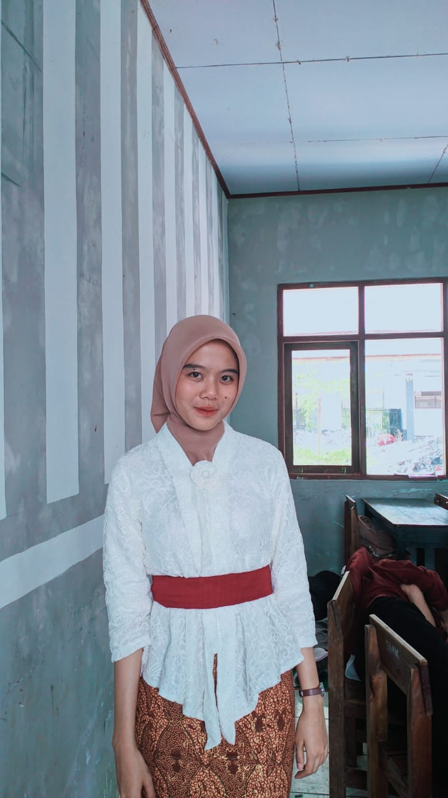
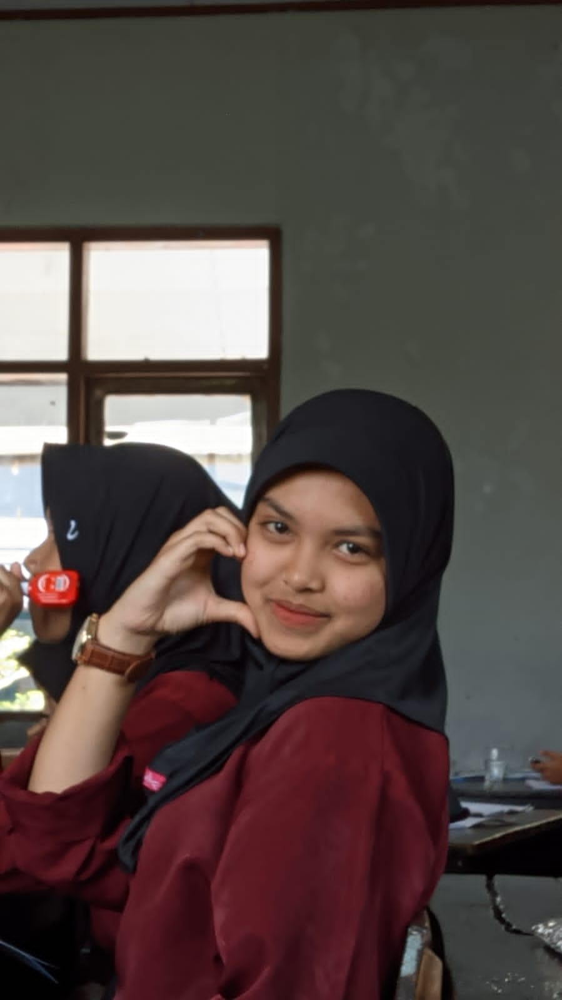
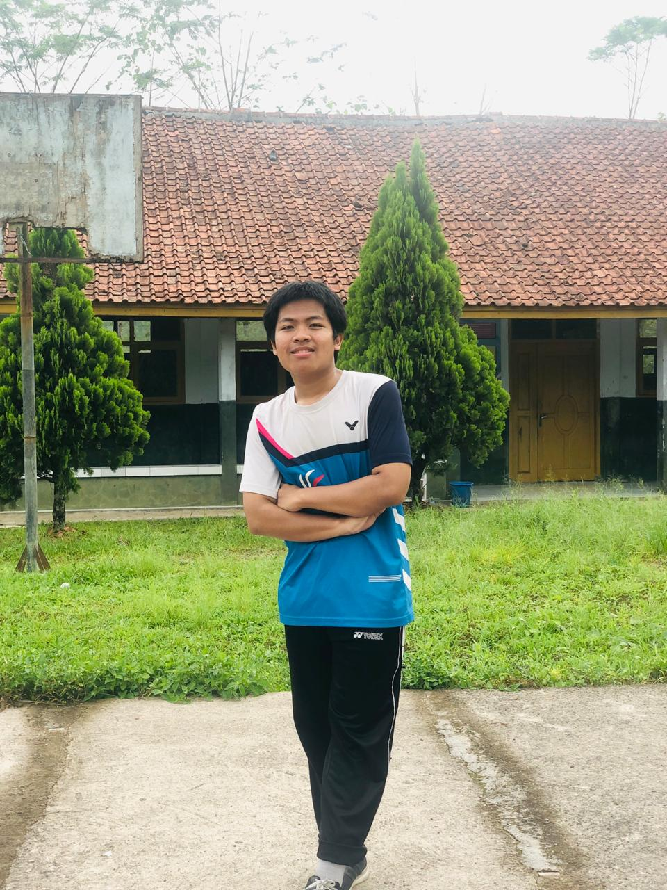

<html lang="en">
  <head>
    <meta charset="UTF-8" />
    <meta http-equiv="x-UA-Compatible" content="IE=edge" />
    <meta name="viewport" content="width=device-width, initial-scale=1.0" />
    <title>XI TKJ 1</title>
    <link rel="preconnect" href="https://fonts.googleapis.com" />
    <link rel="preconnect" href="https://fonts.gstatic.com" crossorigin />
    <link
      href="https://fonts.googleapis.com/css2?family=Poppins:ital,wght@0,300;0,400;0,500;0,600;1,300;1,400;1,500;1,600&display=swap"
      rel="stylesheet"
    />
    <link rel="stylesheet" href="https://www.w3schools.com/w3css/4/w3.css" />
    <link rel="stylesheet" href="bb.css" />
    
    <!--feather icons-->
    
  </head>
  <body>
    <nav class="navbar">
      <a href="#" class="navbar-logo">XI TKJ 1.</a>

      

        <a href="#Home">Home</a>
        <a href="jadwal pelajaran.html">Jadwal Pelajaran</a>
        <a href="jadwal piket.html">Jadwal Piket</a>
        <a href="galeri.html">Galeri</a>
        <a href="#Contact">Contact</a>
      

      

        <a id="hamburger-menu"><i data-feather="menu"></i></a>
      

    </nav>
    <!--about section start-->
    <section id="Home" class="about">
      <h2>XII TKJ1</h2>
      

        

          
        

        

          Hallo selamat datang di dunia virtual kelas
          <strong> XI TKJ 1</strong>. Tujuan kami membuat web ini adalah untuk
          mengabadikan kenangan yang terjadi selama masa sekolah. Terima kasih
          sudah berkunjung.
        

      

    </section>

    <header class="header">
        <h1><b>Anggota Kelas</b></h1>
    </header>

    <section class="products">
        

            
            <h2>PKL</h2>
            <a href="O.html" class="text"><button>
kenangan
</button></a>
        

        

            
            <h2>PKL</h2>
            <a href="O.html" class="text"><button>
kenangan
</button></a>
        

        

            
            <h2>PKL</h2>
            <a href="O.html" class="text"><button>
kenangan
</button></a>
        

        

            
            <h2>PKL</h2>
            <a href="O.html" class="text"><button>
kenangan
</button></a>
        

        

            
            <h2>PKL</h2>
            <a href="O.html" class="text"><button>
kenangan
</button></a>
        

        

            
            <h2>PKL</h2>
            <a href="O.html" class="text"><button>
kenangan
</button></a>
        

        

            
            <h2>PKL</h2>
            <a href="O.html" class="text"><button>
kenangan
</button></a>
        

        

            
            <h2>PKL</h2>
            <a href="O.html" class="text"><button>
kenangan
</button></a>
        

        

            
            <h2>PKL</h2>
            <a href="L.html" class="text"><button>
kenangan
</button></a>
        

        

            
            <h2>PKL</h2>
            <a href="P.html"><button>
kenangan
</button></a>
        

  
            <h2>PKL</h2>
            <a href="P.html"><button>
kenangan
</button></a>
        

                

            
            <h2>PKL</h2>
            <a href="P.html"><button>
kenangan
</button></a>
        

        

            
            <h2>PKL</h2>
            <a href="P.html"><button>
kenangan
</button></a>
        
        

            
            <h2>PKL</h2>
            <a href="P.html"><button>
kenangan
</button></a>
        
        

            
            <h2>PKL</h2>
            <a href="P.html"><button>
kenangan
</button></a>
        

        

            
            <h2>PKL</h2>
            <a href="P.html"><button>
kenangan
</button></a>
        

                

            
            <h2>PKL</h2>
            <a href="P.html"><button>
kenangan
</button></a>
        
       
        

            
            <h2>PKL</h2>
            <a href="P.html"><button>
kenangan
</button></a>
        

    </section>
    <section id="Contact" class="contact">
      <h2>Kontak kami</h2>

      

        
<i data-feather="map-pin"></i> Jalan Neglasari No. 07

        
<i data-feather="phone"></i> Phone: 085798376030

        
<i data-feather="mail"></i> Email: mrdono260726@gmail.com

      

       
    </section>
    <footer class="w3-content w3-padding-64 w3-text-grey w3-xlarge">
      

        <a
          href="https://www.instagram.com/lassjeone?igsh=ODA1NTc5OTg5Nw=="
          id="search"
          ><i data-feather="instagram"></i
        ></a>
        <a
          href="https://www.instagram.com/lassjeone?igsh=ODA1NTc5OTg5Nw=="
          id="search"
          ><i data-feather="facebook"></i
        ></a>
        <a
          href="https://www.instagram.com/lassjeone?igsh=ODA1NTc5OTg5Nw=="
          id="search"
          ><i data-feather="twitter"></i
        ></a>
      

      

        <a href="#Home"><i data-feather="home"></i></a>
        <a href="#Jadwal"><i data-feather="book-open"></i></a>
        <a href="#Galeri"><i data-feather="image"></i></a>
        <a href="#Contact"><i data-feather="phone"></i></a>
      

      

        
Created by <a href="#home">Sayap_kebebasan</a>. | &copy; 2023.

      

    </footer>

    <!--footer end-->

    

    
  </body>
</html>
