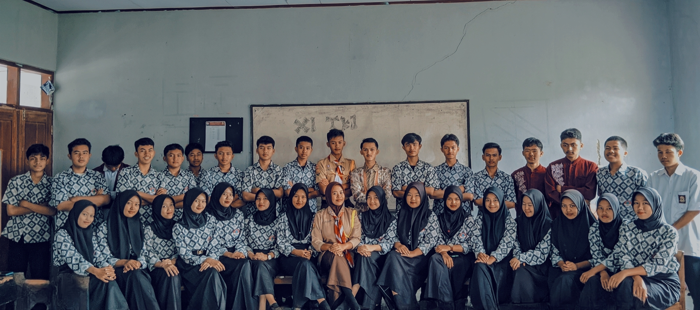
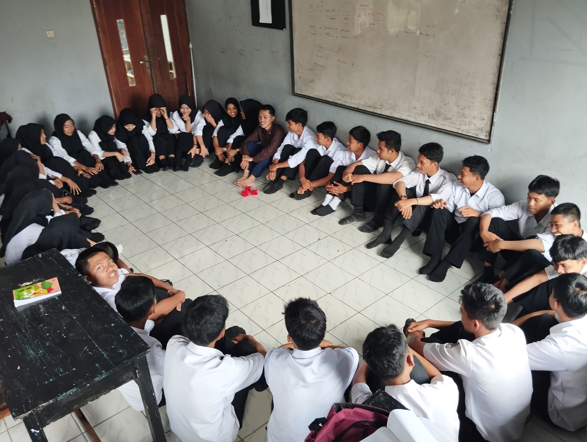

<html lang="en">
  <head>
    <meta charset="UTF-8" />
    <meta name="viewport" content="width=device-width, initial-scale=1.0" />
    <title>XI TKJ 1</title>
    <link rel="stylesheet" href="baru.css"/>
    <link rel="stylesheet" href="https://www.w3schools.com/w3css/4/w3.css">
        <!--feather icons-->
        
        
  </head>
  <body>
    <navbar class="navbar">
      <a href="#" class="navbar-logo">XI TKJ 1</a>
      

        <a href="#home">Home</a>
        <a href="#about">About</a>
        <a href="#jadwal">Jadwal</a>
        <a href="#galeri">Galeri</a>
        <a href="#contact">Kontak</a>
      

    </navbar>

 <section class="hero" id="#home">

    <h1>XI TKJ 1</h1>

    </section>

        <!--about section start-->
  <section id="#about" class="about">
            <h2>Tentang kami</h2>
          

            

              
            

            
Hallo selamat datang di dunia virtual kelas <STrong> XI TKJ 1</STrong>. Tujuan kami membuat web ini adalah untuk mengabadikan kenangan yang terjadi selama masa sekolah. Terima kasih sudah berkunjung.

          

  </section>
  

        <!--about section start-->
  <section id="#jadwal" class="about">
          <h2>jadwal Pelajaran</h2>

<table border="1px" class="table">
<tr>
  <th colspan="3">Senin</th>
</tr>
<tr>
  <th>Nama Pelajaran</th>
  <th>Jam Pelajaran</th>
  <th>Nama Guru Mapel</th>
</tr>
<tr>
  <td>Bahasa Jepang</td>
  <td>08.00 - 09.10</td>
  <td>Shopi Sensei</td>
</tr>
<tr>
  <td>ASJ</td>
  <td>09.10 - 09.45</td>
  <td>Pak Faris</td>
</tr>
<tr>
  <td>Istirahat</td>
  <td>09.45 - 10.15</td>
  <td>-</td>
</tr>
<tr>
  <td>ASJ</td>
  <td>10.15 - 10.50</td>
  <td>Pak Faris</td>
</tr>
<tr>
  <td>AIJ</td>
  <td>10.50 - 11.25</td>
  <td>Pak Azka</td>
</tr>
<tr>
  <td>TLJ</td>
  <td>11.25 - 12.00</td>
  <td>Pak Asri</td>
</tr>
<tr>
  <td>Shalat Dzuhur</td>
  <td>12.00 - 12.30</td>
  <td>-</td>
</tr>
<tr>
  <td>TLJ</td>
  <td>12.30 - 13.00</td>
  <td>Pak Asri</td>
</tr>
<tr>
  <td>AIJ</td>
  <td>13.00 - 13.30</td>
  <td>Pak Azka</td>
</tr>
</table>

  <table border="1px" class="table">
  <tr>
    <th colspan="3">Selasa</th>
  </tr>
  <tr>
    <th>Nama Pelajaran</th>
    <th>Jam Pelajaran</th>
    <th>Nama Guru Mapel</th>
  </tr>
  <tr>
    <td>ASJ</td>
    <td>07.25 - 08.35</td>
    <td>Pak Faris</td>
  </tr>
  <tr>
    <td>AIJ</td>
    <td>08.35 - 09.10</td>
    <td>Pak Azka</td>
  </tr>
  <tr>
    <td>TJBL</td>
    <td>09.10 - 09.45</td>
    <td>Pak Herman</td>
  </tr>
  <tr>
    <td>Istirahat</td>
    <td>09.45 - 10.15</td>
    <td>-</td>
  </tr>
  <tr>
    <td>TJBL</td>
    <td>10.15 - 11.25</td>
    <td>Pak Herman</td>
  </tr>
  <tr>
    <td>AIJ</td>
    <td>11.25 - 12.00</td>
    <td>Pak Azka</td>
  </tr>
  <tr>
    <td>Shalat Dzuhur</td>
    <td>12.00 - 12.30</td>
    <td>-</td>
  </tr>
  <tr>
    <td>MTK</td>
    <td>12.30 - 13.30</td>
    <td>Bu Ranti</td>
  </tr>
  </table>
  

  

    <table border="1px" class="table">
    <tr>
      <th colspan="3">Rabu</th>
    </tr>
    <tr>
      <th>Nama Pelajaran</th>
      <th>Jam Pelajaran</th>
      <th>Nama Guru Mapel</th>
    </tr>
    <tr>
      <td>TJBL</td>
      <td>07.25 - 08.35</td>
      <td>Pak Herman</td>
    </tr>
    <tr>
      <td>PPKN</td>
      <td>08.35 - 09.45</td>
      <td>Pak Ruslandi</td>
    </tr>
    <tr>
      <td>Istirahat</td>
      <td>09.45 - 10.15</td>
      <td>-</td>
    </tr>
    <tr>
      <td>PJOK</td>
      <td>10.15 - 11.25</td>
      <td>Pak Sulung</td>
    </tr>
    <tr>
      <td>TJBL</td>
      <td>11.25 - 12.00</td>
      <td>Pak Herman</td>
    </tr>
    <tr>
      <td>Shalat Dzuhur</td>
      <td>12.00 - 12.30</td>
      <td>-</td>
    </tr>
    <tr>
      <td>PPK</td>
      <td>12.30 - 13.00</td>
      <td>Pak Dadang</td>
    </tr>
    </table>
  

   

      <table border="1px" class="table">
      <tr>
        <th colspan="3">Kamis</th>
      </tr>
      <tr>
        <th>Nama Pelajaran</th>
        <th>Jam Pelajaran</th>
        <th>Nama Guru Mapel</th>
      </tr>
      <tr>
        <td>AIJ</td>
        <td>08.00 - 09.10</td>
        <td>Pak Azka</td>
      </tr>
      <tr>
        <td>TLJ</td>
        <td>09.10 - 09.45</td>
        <td>Pak Asri</td>
      </tr>
      <tr>
        <td>Istirahat</td>
        <td>09.45 - 10.15</td>
        <td>-</td>
      </tr>
      <tr>
        <td>TLJ</td>
        <td>10.15 - 12.00</td>
        <td>Pak Asri</td>
      </tr>
      <tr>
        <td>Bahasa Indonesia</td>
        <td>12.30 - 13.30</td>
        <td>Bu Renwy</td>
      </tr>
      </table>
      

   

        <table border="1px" class="table">
        <tr>
          <th colspan="3">Jum'at</th>
        </tr>
        <tr>
          <th>Nama Pelajaran</th>
          <th>Jam Pelajaran</th>
          <th>Nama Guru Mapel</th>
        </tr>
        <tr>
          <td>Bahasa Inggris</td>
          <td>07.25 - 08.35</td>
          <td>Ms. Sheny</td>
        </tr>
        <tr>
          <td>PAI</td>
          <td>08.35 - 09.45</td>
          <td>Pak Iman</td>
        </tr>
        <tr>
          <td>Istirahat</td>
          <td>09.45 - 10.15</td>
          <td>-</td>
        </tr>
        <tr>
          <td>PAI</td>
          <td>10.15 - 10.50</td>
          <td>Pak Iman</td>
        </tr>
        <tr>
          <td>Bahasa Indonesia</td>
          <td>10.50 - 11.25</td>
          <td>Bu Renwy</td>
        </tr>
        </table>
      

  

          <table border="1px" class="table">
          <tr>
            <th colspan="4">Sabtu</th>
          </tr>
          <tr>
            <th>Nama Pelajaran</th>
            <th>Jam Pelajaran</th>
            <th>Nama Guru Mapel</th>
          </tr>
          <tr>
            <td>MTK</td>
            <td>07.25 - 08.35</td>
            <td>Bu Ranti</td>
          </tr>
          <tr>
            <td>PPK</td>
            <td>08.35 - 09.45</td>
            <td>Pak Dadang</td>
          </tr>
          <tr>
            <td>Istirahat</td>
            <td>09.45 - 10.15</td>
            <td>-</td>
          </tr>
          <tr>
            <td>ASJ</td>
            <td>10.15 - 11.25</td>
            <td>Pak Faris</td>
          </tr>
          </table>
          

</section>
        <!-- Portfolio Section -->
  

  

    

    <h2>Galleri</h2>
  

    

    <!-- Grid for photos -->
    

      

        
        
        
        
      

  

        
        
        
        <a class="w3-button w3-round-xxlarge w3-small w3-light-blue sky" href="Dokumentasi XI TKJ 1.html" target="_blank">LAINNYA</a>
      

    <!-- End photo grid -->
    

  <!-- End Portfolio Section -->

  

        <section id="#contact" class="contact">
            <h2>Kontak kami</h2>
            
  

      
<i data-feather="map-pin"></i> Jalan Neglasari No. 07

      
<i data-feather="phone"></i> Phone: 085798376030

      
<i data-feather="mail"></i> Email: mrdono260726@gmail.com

    
 
</section>
  <footer class="w3-content w3-padding-64 w3-text-grey w3-xlarge">
            

              <a href="https://instagram.com/goesone11?igshid=OGQ5ZDc2ODk2ZA==" id="search"><i data-feather="instagram"></i></a>
              <a href="https://instagram.com/goesone11?igshid=OGQ5ZDc2ODk2ZA==" id="search"><i data-feather="facebook"></i></a>
              <a href="https://instagram.com/goesone11?igshid=OGQ5ZDc2ODk2ZA==" id="search"><i data-feather="twitter"></i></a>
            

          
  

              <a href="#home"><i data-feather="home"></i></a>
              <a href="#about"><i data-feather="info"></i></a>
              <a href="#jadwal"><i data-feather="book-open"></i></a>
              <a href="#contact"><i data-feather="phone"></i></a>
            

      
   

              
Created by <a href="#home">Sayapkebebasan</a>. | &copy; 2023.

            

          </footer>
      
          <!--footer end-->

        <!--feather icons-->
   
      
          <!--my javascript-->
  
  </body>
</html>
